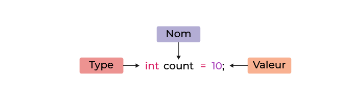

# Déclarer des variables

> Une `variable` est un **outil contenant une donnée** (*un mot ou un chiffre*) et va être utilisée par un programme.

> Une **donnée placée dans une variable** s'appelle une `valeur` et chaque boite contient une valeur.

## Nommer une variable

> Le nom de la variable doit **refléter la signification de son contenu** :
>- Utiliser des noms descriptifs
>- Ne pas abréger les mots
>- Suivre la convention `Camel Case` (*nomDeVariable*) 

## Déclarer une variable

> Il existe plusisurs types de varibales en Java. Elles sont utilisées en fonction du type de valeur qu'elles contiennent.

Pour qu'une variable **stocke des nombres entiers** ont utilise un `int`.
```Java
int variable = 500;
```
Dans la déclaration ci-dessus une valeur par défaut a été assignée.

> Chaque instruction Java se termine par `;` cela permet au programme de comprendre ce qui est demandé.

> En Java le type `int` ne stocke que des nombres entiers. Pour les nombres à virgules il faut utiliser les types `double` ou `float`.

## Modifier la valeur d'une variable avec les opérateurs

> Les **règles arithmétiques** habituelles s'appliquent en code.

```Java
int variable = 10;

variable = 30;

variable = variable + 20;
```

> Une affectation est composée de 3 éléments :
>- L'**opérateur d'affectation** est `=`.
>- A **gauche** de l'opérateur d'affectation, on écrit le `nom de la variable` à laquelle on modifie le résultat.
>- A **droite** de l'opérateur d'affectation, on écrit une `expression`.

## Les variables qui ne changent jamais

> Une variable avec une **valeur qui ne change pas** s'appelle une `constante`. Tout comme les autres variables, les constantes sont décrites par trois composantes : `Type`, `Nom` et `Valeur`. <br>
> La seule différence est qu'une fois définie, **la valeur de la constante ne peut plus être modifiée**.

> Lors de l'écriture d'un code, il est **conseillé d'utiliser les constantes dans la mesure du possible**.

> Le nom d'une constante en Java est `toujours en majuscules`, cela permet de les reconnaitre.

```Java
int variableClassique = 100;

final int VARIABLEFIXE = 50;
```


# Choisir le bon type de variable

## Spécifier le type de variable



> Pour déclarer une variable, il faut commencer par le `type`, puis le `nom` et enfin la `valeur`. **Si l'on ne met pas de valeur, il faut quand même définir le type**.

> Cependant, lorsque l'on déclare une variable en **spécifiant uniquement son type**, `celle-ci ne peut pas être utilisée tant qu'on ne lui a pas attribué une valeur`.

Il est possible de combiner les types afin d'en construire des plus complexes.

## Découvrir les types numériques

> Le `int` est l'un des types primitifs les plus utilisés. Il existe également le `long`, une version qui permet de stocker des nombres encore plus grands.

> Chaque type a ses avantages et ses inconvénients : un **type précis prendra plus de place en mémoire**, mais un **type moins précis** (plus léger) pourrait ne **pas suffire à stocker l'information** voulue.

> Pour une **précision jusqu'à 2 décimales** après la virgule, on peut utiliser `float`. Au dela, ce sera `double`.

## Découvrir les booléens

> Une valeur booléene **prend le plus petit emplacement de la mémoire** (un seul bit). Les booléens sont `principalement utilisés pour les conditions`.

```Java
boolean variableBooleen = true;

boolean variableBool2 = false;
```

## Utiliser le type String pour les chaines de caractères

> Les `String` permettent de stocker du **texte**, ou en d'autres termes, **un ensemble de caractères**.

```Java
String firstFavoriteCity = "New York";
String secondFavoriteCity = "Buenos Aires";
String favorites = firstFavoriteCity + secondFavoriteCity; 
// -> "New YorkBuenos Aires"
```

```Java
String firstFavoriteCity = "New York"
String secondFavoriteCity = "Buenos Aires"
String favorites = "My favorite cities are " +firstFavoriteCity+ " and "+secondFavoriteCity; 
// -> "My favorite cities are New York and Buenos Aires"
```